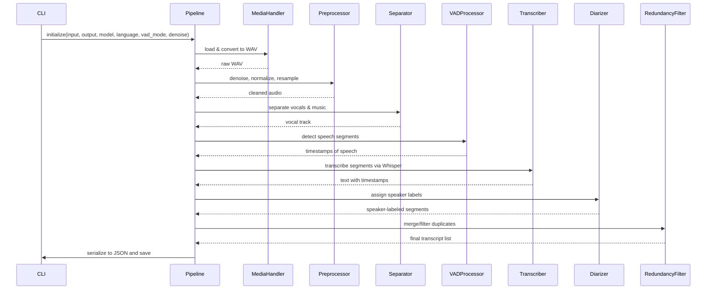

# Audio Processing & Transcription Pipeline

A modular Python pipeline for processing audio files—covering media conversion, noise reduction, vocal separation, speech segmentation, automatic transcription with OpenAI Whisper, speaker diarization with Pyannote, and redundancy filtering.

---

## Table of Contents

* [Overview](#overview)
* [Features](#features)
* [Architecture](#architecture)
* [Prerequisites](#prerequisites)
* [Installation](#installation)
* [Configuration](#configuration)
* [Usage](#usage)
* [Pipeline Modules](#pipeline-modules)
* [Contributing](#contributing)
* [License](#license)

---

## Overview

This project provides a flexible, end-to-end audio processing pipeline to:

1. **Convert & normalize** raw media into uniform WAV format
2. **Denoise & preprocess** audio (resampling, gain normalization)
3. **Separate vocals** from background music (Spleeter)
4. **Detect speech** segments (WebRTC VAD)
5. **Transcribe** speech with OpenAI Whisper
6. **Diarize** speakers (Pyannote)
7. **Filter redundancy** to merge or remove duplicate segments

Use the provided CLI entrypoint (`main.py`) for a one-command experience, or import `pipeline.AudioPipeline` into your own application.

---

## Features

* 🔄 **Media Handling:** FFmpeg-based conversion to WAV
* 🎚️ **Preprocessing:** Noise reduction, resampling, normalization
* 🎵 **Separation:** Vocal/instrument split via Spleeter
* 🎙️ **VAD:** WebRTC Voice Activity Detection for accurate speech cuts
* 🤖 **Transcription:** Whisper ASR with configurable models and language
* 👥 **Diarization:** Pyannote speaker turn labeling
* ♻️ **Redundancy Removal:** Filters overlapping or duplicate text
* 🛠️ **Modular Design:** Swap or skip steps easily

---

## Architecture

At its core, `pipeline.py` defines an `AudioPipeline` class that orchestrates all steps in sequence. The CLI in `main.py` loads environment variables, parses arguments (input path, output path, model, language, thresholds), and instantiates the pipeline.

```
AudioPipeline(
    input_path: str,
    output_path: str,
    model: str = "small",
    language: str = "en",
    vad_mode: str = "3",
    denoise: bool = True,
)
```

Each module (in the `pipeline/` directory) implements a single responsibility and exposes a clear interface:

1. **MediaHandler** (`media_handler.py`)
2. **Preprocessor** (`preprocessor.py`)
3. **Separator** (`separator.py`)
4. **VADProcessor** (`vad.py`)
5. **Transcriber** (`transcriber.py`)
6. **Diarizer** (`diarizer.py`)
7. **RedundancyFilter** (`redundancy.py`)
### Sequence Diagram



---

## Prerequisites

* Python 3.8+
* ffmpeg installed and in PATH
* [Spleeter](https://github.com/deezer/spleeter) dependencies

---

## Installation

1. **Clone the repository**

   ```bash
   git clone https://github.com/yourusername/audio-pipeline.git
   cd audio-pipeline
   ```

2. **Create & activate a virtual environment**

   ```bash
   python3 -m venv venv
   source venv/bin/activate
   ```

3. **Install Python dependencies**

   ```bash
   pip install -r requirements.txt
   ```

4. **Install FFmpeg**

   ```bash
   # macOS (Homebrew)
   brew install ffmpeg

   # Ubuntu/Debian
   sudo apt update && sudo apt install ffmpeg
   ```

---

## Configuration

Copy `.env.example` to `.env` and set your API credentials:

```dotenv
OPENAI_API_KEY=your_openai_key_here
PYANNOTE_TOKEN=your_pyannote_token_here
```

You can override defaults by passing CLI flags or editing `config.py`:

* `DEFAULT_MODEL` (Whisper model: `tiny`, `base`, `small`, `medium`, `large`)
* `DEFAULT_LANGUAGE` (e.g. `en`, `pt`)
* VAD and denoising parameters

---

## Usage

Run the CLI to process an audio file:

```bash
python main.py \
  --input path/to/input.mp3 \
  --output path/to/output.json \
  --model small \
  --language en \
  --vad_mode 3 \
  --denoise true
```

* `--input` & `--output`: input file and desired JSON output path
* `--model`: Whisper model size
* `--language`: language code for transcription
* `--vad_mode`: WebRTC VAD aggressiveness (0–3)
* `--denoise`: enable/disable spectral denoising

Output JSON contains timestamped, speaker‐labeled transcripts.

---

## Pipeline Modules

| Module            | File               | Responsibility                                  |
| ----------------- | ------------------ | ----------------------------------------------- |
| Media Handler     | `media_handler.py` | Convert to WAV, load audio                      |
| Preprocessor      | `preprocessor.py`  | Normalize, resample, denoise                    |
| Separator         | `separator.py`     | Vocal/instrument separation (Spleeter)          |
| VAD               | `vad.py`           | Detect speech segments (WebRTC VAD)             |
| Transcriber       | `transcriber.py`   | Transcribe with Whisper ASR                     |
| Diarizer          | `diarizer.py`      | Speaker turn detection (Pyannote)               |
| Redundancy Filter | `redundancy.py`    | Merge or drop overlapping/duplicate transcripts |
| Orchestrator      | `pipeline.py`      | Chain modules into a unified pipeline           |
| CLI Entrypoint    | `main.py`          | Argument parsing & pipeline invocation          |

---

## Contributing

Contributions, issues, and feature requests are welcome! Please fork the repo and submit a pull request.

1. Fork it
2. Create your feature branch (`git checkout -b feature/YourFeature`)
3. Commit your changes (`git commit -am 'Add YourFeature'`)
4. Push to branch (`git push origin feature/YourFeature`)
5. Open a Pull Request

---

## License

This project is licensed under the MIT License. See [LICENSE](LICENSE) for details.
